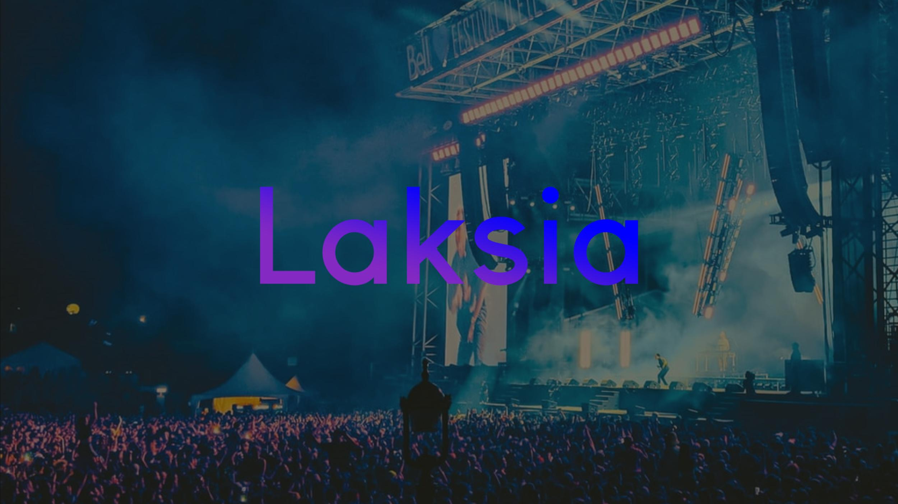

# Getting Started Laksia (SAAS)

    
  </a>

## Requirements to raise the project

Have installed `node.js`
or [download here !!](https://nodejs.org)
Then check it works `node -v` check if is installed and which version , then `npm -v` check npm now in available in your computer and version.

## - Available Scripts

In the project directory, you can run:

### Develop mode:

### `npm install` update or download project dependencies.

### `npm start` run project in local development version

Open [http://localhost:3000](http://localhost:3000) to view it in your browser.

The page will reload when you make changes.\

### Docker in Develop mode

### In terminal run `docker-compose up local_dev`

Local environment

### In terminal run `./dev-run.sh`

Development environment

### Docker in Production mode

Production environment

### In terminal run `./prod-run.sh`

Use this command if you have installed docker in your computer or [download here!!!](https://docs.docker.com/engine/install/).

Runs command in terminal in development mode.\
